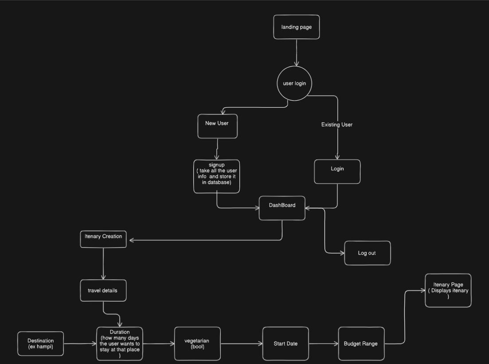
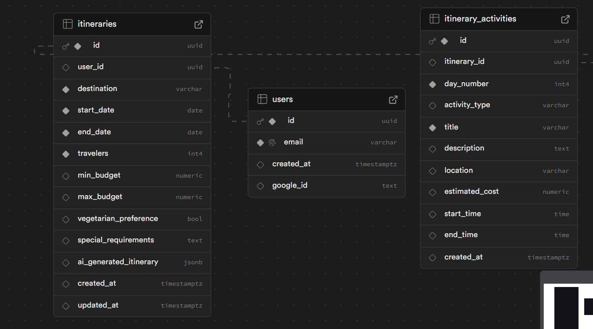

# AI Itinerary Generator

> Your personal travel companion that turns trip planning from a chore into a joy! 🎉

Imagine having a travel expert at your fingertips, ready to craft the perfect itinerary for your next adventure. That's exactly what AI Itinerary Generator does - it combines the power of artificial intelligence with intuitive design to make trip planning effortless and enjoyable.

- AI-powered itinerary generation
- User-friendly interface
- Real-time suggestions
- Customizable travel plans
- Secure user authentication
- Database integration for storing itineraries

- 🤖 **Smart Planning**: Our AI understands your preferences and creates personalized itineraries that match your travel style
- 🎯 **Real-time Suggestions**: Get instant recommendations as you plan your trip
- 🎨 **Beautiful Interface**: A clean, modern design that makes planning fun
- 🔒 **Secure & Private**: Your travel plans are safe with us
- 💾 **Save **: Store your itineraries

## 🛠️ Behind the Scenes

### Backend Magic

- Python 3.x with Flask for robust server-side operations
- Supabase and PostgreSQL for reliable data storage
- Groq integration for intelligent AI responses
- Gunicorn ensuring smooth performance

### Frontend Charm

- React.js for a responsive and dynamic user interface
- Modern UI/UX principles for an intuitive experience

## 📁 Project Structure

```
ai-itenary/
├── backend/          # The brains of the operation
│   ├── app.py       # Main application logic
│   ├── config.py    # Configuration settings
│   ├── models.py    # Data structure definitions
│   ├── services/    # Business logic
│   └── requirements.txt
└── client/
    └── my-project/  # The beautiful face of our application
```

## 🚀 Getting Started

### Backend Setup

1. Create your virtual environment:

   ```bash
   python -m venv venv
   source venv/bin/activate  # On Windows: venv\Scripts\activate
   ```

2. Install the magic ingredients:

   ```bash
   cd backend
   pip install -r requirements.txt
   ```

3. Set up your environment variables in `.env`:

   ```
   SUPABASE_URL=your_supabase_url
   SUPABASE_KEY=your_supabase_key
   GROQ_API_KEY=your_groq_api_key
   ```

4. Start the backend:
   ```bash
   python app.py
   ```

### Frontend Setup

1. Navigate to the client:

   ```bash
   cd client/my-project
   ```

2. Install dependencies:

   ```bash
   npm install
   ```

3. Launch the development server:
   ```bash
   npm start
   ```

## 🔄 How It Works

### User Journey

Take a look at how users interact with our application:



Our user flow is designed to be intuitive and engaging, guiding users from initial trip planning to final itinerary creation.

### Data Architecture

Here's how we organize and store your travel data:



Our database structure ensures efficient data management while maintaining the flexibility needed for personalized travel planning.

## 🤝 Contributing

We love contributions! Here's how you can help:

1. Fork the repository
2. Create your feature branch
3. Make your changes
4. Submit a pull request

## 📜 License

This project is licensed under the MIT License - see the LICENSE file for details.

## 💌 Get in Touch

Have questions or suggestions? We'd love to hear from you! Open an issue in the repository or reach out to our team.

---
